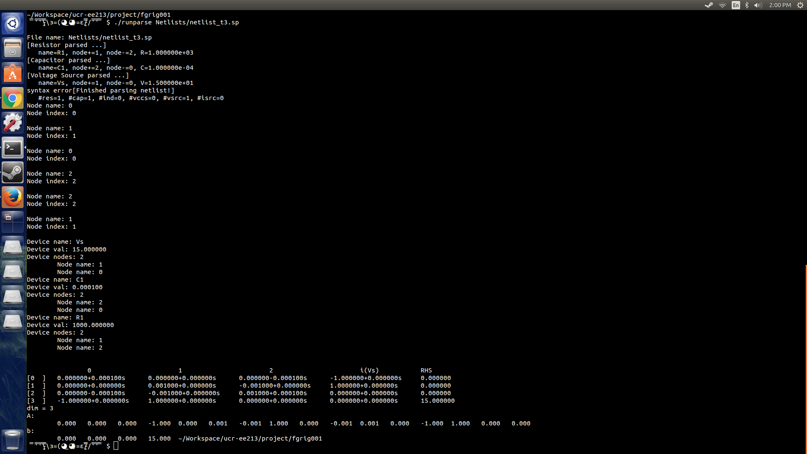
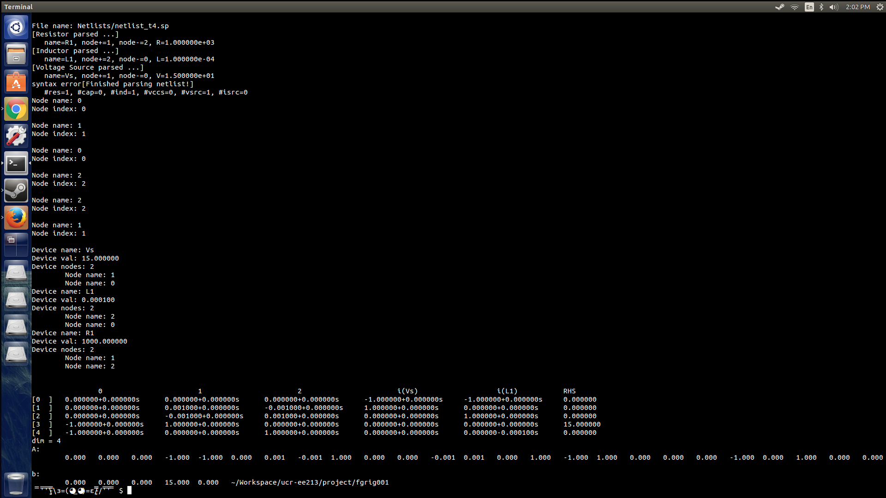

EE 213 Final Project
====================
Frederick Grigsby - fgrig001

Running the Parser
------------------

To compile the parser in Linux, type and run.
```sh
make
```
To run the parser on a netlist simply run it as follows.
```sh
./runparse Netlists/netlist_t1.sp
```

The folder "Netlists" contains a variety of sample netlists for you to run.

Project Report
----------------

This parser will handle a variety of circuit components including
* Resistors
* Inductors 
* Capacitors
* Current Sources
* Voltage Sources
* Voltage Controlled Current Sources

The output includes both real and imaginary components as well as branch 
and branch-current rows/columns for floating voltage sources, making this
a true MNA parser. 

Examples
--------
Here we can see the result of parsing netlist_t3.sp, which is a simple RC
circuit with a voltage source. As you can see we have successfully parsed the
file and have a separate row/column for the voltage source as is expected
with MNA. The capacitor values also show up as imaginary numbers as expected.


The results of parsing netlist_t4.sp, a simple RL circuit, also gives correct
output. Here we must have a separate row/column for both the voltage source
as well as the inductor, and we see that this the what is correctly being 
output.



